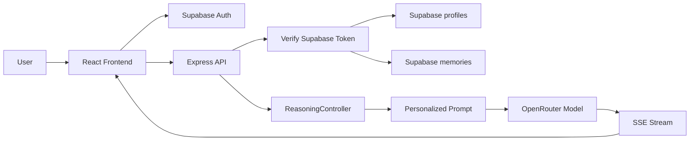
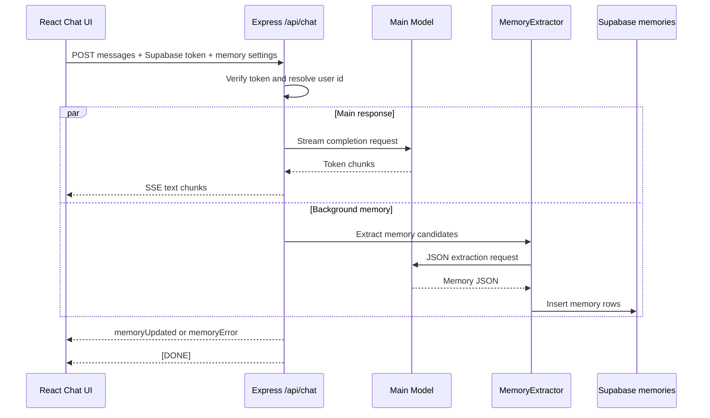
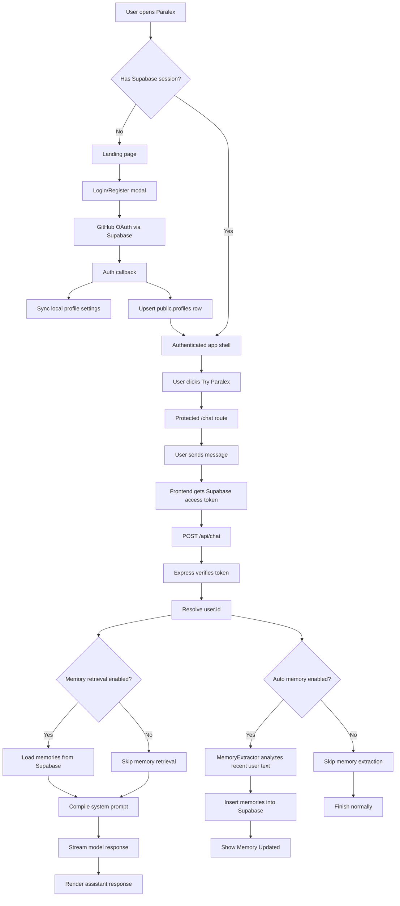
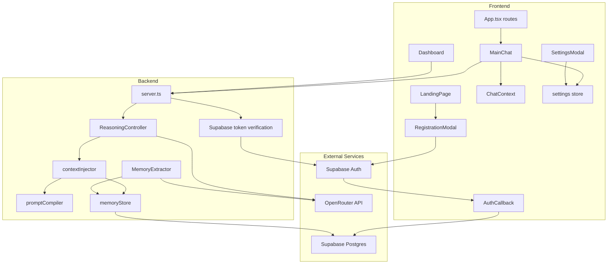
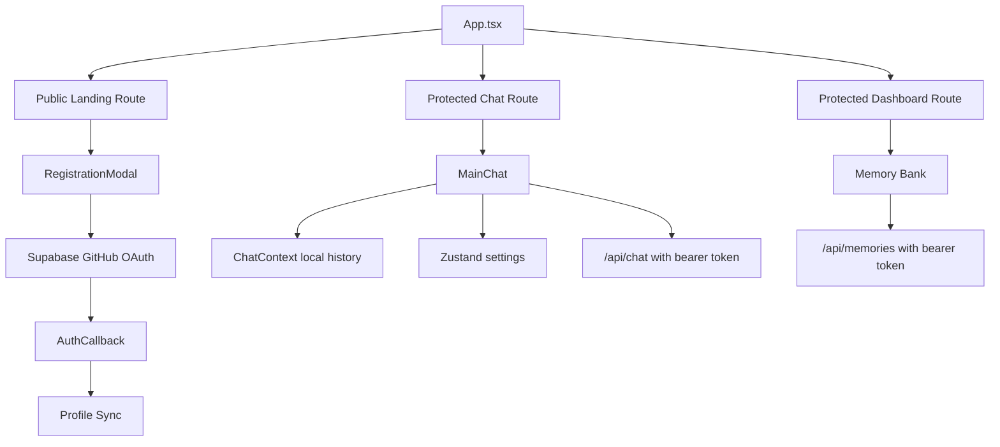

# Paralex Operational Flow

Paralex is a React + Express AI assistant that combines a polished chat interface, Supabase authentication, user profile persistence, long-term memory, and OpenRouter-compatible model streaming. The system is designed around a fast linear response path, with heavier personalization and memory work running in the background so the user sees answers quickly.

## High Level System

Paralex has four main layers:

1. **Frontend application**
   - React 19 + Vite.
   - Routes are managed with `react-router-dom`.
   - Chat state and settings are stored locally with React context and Zustand.
   - GitHub OAuth is handled through Supabase Auth.

2. **Backend application**
   - Express server in `server.ts`.
   - Serves API routes and runs Vite middleware during development.
   - Streams model responses to the frontend with Server-Sent Events.
   - Verifies Supabase access tokens before protected API work.

3. **AI orchestration**
   - `ReasoningController` formats requests and streams model output.
   - `contextInjector` adds personalization and memory context into the system prompt.
   - `promptCompiler` combines the base Paralex prompt with user settings and retrieved memories.

4. **Data and identity**
   - Supabase Auth handles GitHub login/register.
   - `profiles` stores GitHub profile details.
   - `memories` stores extracted user facts and preferences.
   - Browser local storage stores local chat history and UI settings.

## Why Paralex Uses Linear Reasoning

Paralex currently favors a **linear reasoning path** for normal chat completion. Instead of spawning multiple agent branches for every user query, the backend formats one optimized model request and streams it directly.

This design is intentional:

- **Lower latency:** users receive tokens as soon as the model starts responding.
- **Simpler failure handling:** one request path is easier to recover from than several parallel model calls.
- **Lower cost:** each chat turn uses one main completion request.
- **Predictable UX:** streaming starts quickly and feels responsive.
- **Cleaner personalization:** memory and settings are injected before the response, instead of merged after several competing outputs.

The code still has room for richer orchestration later. Files such as `server/orchestrator/policies.ts` and `server/orchestrator/prompts.ts` suggest a future multi-role reasoning system, but the current production path is intentionally linear.

## Parallel Background Processing

Although final answer generation is linear, Paralex still performs some work in parallel.

During `/api/chat`:

1. The backend verifies the Supabase session.
2. The response-generation pipeline starts.
3. Memory extraction may run concurrently in the background.
4. The model response streams to the frontend.
5. When generation finishes, the backend awaits memory extraction.
6. The frontend receives either `memoryUpdated` or `memoryError`.

This gives Paralex a useful balance:

- The assistant can answer quickly.
- Memory can be extracted without blocking the visible response.
- Memory errors do not crash the main answer path.
- The UI can still notify the user when memory was saved.

## MemoryExtractor Responsibilities

`server/memoryExtractor.ts` is responsible for turning recent conversation content into structured long-term memory.

Its responsibilities are:

- Read the last few chat messages.
- Collect recent user-authored text.
- Ask the configured model to extract explicit facts, preferences, or project details.
- Require strict JSON output.
- Validate that each extracted item has at least:
  - `text`
  - `type`
  - optional `importanceScore`
- Write valid memories to Supabase through `memoryStore`.
- Report success or failure back to `/api/chat`.

The extractor should save only durable, useful information. Good memories are facts like:

- "User prefers concise TypeScript examples."
- "User is building Paralex with Supabase."
- "User wants GitHub-only authentication."

Weak memories should be avoided:

- One-off requests.
- Temporary instructions.
- Sensitive information unless the user explicitly asks to save it.
- Vague statements that will not help future responses.

## Full End-to-End Lifecycle

## Paralex Architecture

## Front End Architecture Flow

The frontend is organized around routes, shared state, and a small set of major UI surfaces.

- `src/App.tsx`
  - Defines routes.
  - Protects `/chat`, `/dashboard`, and `/LandingPagewithDashboard`.
  - Syncs Supabase profile metadata into local settings.

- `src/pages/LandingPage.tsx`
  - Public landing page.
  - Opens login/register modal when unauthenticated users click Try Paralex.
  - Sends authenticated users to `/chat`.

- `src/components/RegistrationModal.tsx`
  - Starts GitHub OAuth through Supabase.

- `src/pages/AuthCallback.tsx`
  - Completes Supabase OAuth exchange.
  - Syncs profile data locally.
  - Upserts the `profiles` table.

- `src/context/ChatContext.tsx`
  - Stores local chat sessions.
  - Adds system prompt and messages to local chat history.

- `src/components/MainChat.tsx`
  - Sends chat requests.
  - Attaches Supabase access token.
  - Streams SSE chunks into the assistant message.
  - Displays memory status notifications.

- `src/components/SettingsModal.tsx`
  - Controls profile, personalization, model, memory, appearance, and privacy settings.
  - Memory toggles affect backend behavior through `memorySettings`.

## User Workflow

1. User lands on the public Paralex page.
2. User clicks **Register**, **Log in**, or **Try Paralex**.
3. If not authenticated, Paralex opens the GitHub auth modal.
4. Supabase handles GitHub OAuth.
5. The callback stores profile details in:
   - local settings
   - Supabase `profiles`
6. User enters the authenticated app.
7. User opens chat.
8. User sends a message.
9. The frontend sends:
   - messages
   - selected model
   - search setting
   - memory settings
   - Supabase bearer token
10. Backend verifies the token.
11. Backend injects settings and, if enabled, memories.
12. Model response streams back to the UI.
13. Memory extraction runs in the background if enabled.
14. New memories appear in Supabase and the dashboard Memory Bank.

## Models Used

Paralex uses OpenRouter-compatible model IDs. The current UI exposes these model options in `src/components/MainChat.tsx` and `src/components/SettingsModal.tsx`:

| Model ID | Display Name | Provider | Current Usage |
|---|---|---|---|
| `openai/gpt-oss-20b:free` | GPT OSS 20B | OpenAI | Default model and fallback model |
| `nvidia/nemotron-3-nano-omni-30b-a3b-reasoning:free` | Nemotron 3 Nano Omni Reasoning | NVIDIA | User-selectable chat model |
| `baidu/cobuddy:free` | Baidu Cobuddy | Baidu | User-selectable chat model |
| `poolside/laguna-m.1:free` | Poolside: Laguna M.1 | Poolside | User-selectable chat model |

The backend uses the selected model for:

- Main streamed assistant responses.
- Memory extraction, unless no model is provided, in which case it falls back to `openai/gpt-oss-20b:free`.

## Memory Toggle Semantics

The three memory controls work together:

| Toggle | Backend Effect |
|---|---|
| Memory Toggle | Master switch. If off, Paralex does not retrieve memories and does not save new memories. |
| Conversation Continuity | If on, saved memories are retrieved and injected into future prompts. |
| Auto Memory Detection | If on, recent user messages are analyzed and durable facts are saved. |

When the master Memory Toggle is off, the UI disables Conversation Continuity and Auto Memory Detection to make the dependency clear.

## Important Data Tables

### `profiles`

Stores user account details from GitHub/Supabase.

Expected fields:

- `id`
- `full_name`
- `email`
- `avatar_url`
- `github_username`
- `created_at`

### `memories`

Stores long-term user facts and preferences.

Expected fields:

- `id`
- `user_id`
- `text`
- `type`
- `importance_score`
- `source_chat_id`
- `status`
- `created_at`
- `updated_at`
- `last_used_at`
- `metadata`

Because `memories` uses RLS, policies must allow authenticated users to select, insert, update, and delete rows where `auth.uid() = user_id`.

